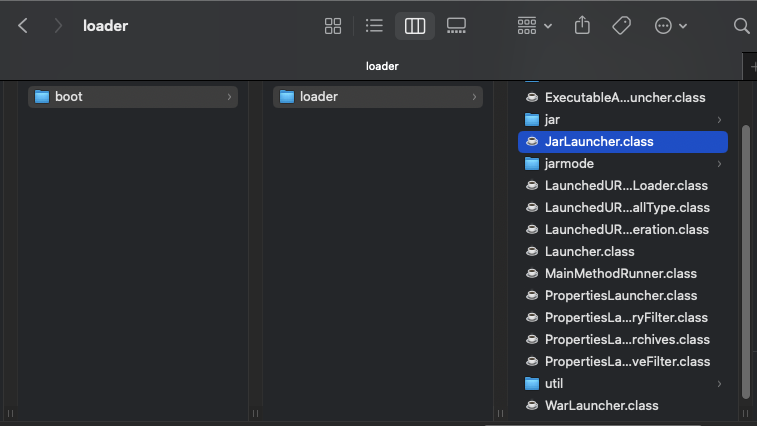

## JAR 소개

- 자바는 여러 클래스와 리소스를 묶어서 `JAR` (Java Archive) 라고 하는 압축 파일을 만들 수 있다
- 이 파일은 JVM 위에서 직접 실행되거나 또는 다른 곳에서 사용하는 라이브러리로 제공된다
  - `JAR` 파일안에 main 메서드가 있어서 직접 실행하거나 OR 다른 곳에서 라이브러리로 사용하거나
  - `java -jar abc.jar` 이런식으로 명령어를 통해 실행한다
  - 직접 실행하려면 위에서 이야기했듯 `main()` 메서드가 필요하고, `MANIFEST.MF` 파일에 실행할 메인 메서드가 있는 클래스를 지정해두어야 한다
- 즉, 단순하게 생각하자면 `JAR` 는 클래스와 관련 리소스를 압축한 단순한 파일이다

</br>
</br>

## WAR 소개

- WAR (Web Application Archive) 라는 이름에서 알 수 있듯 WAR 파일은 웹 애플리케이션 서버(WAS) 에 배포할 때 사용하는 파일이다
- JAR 파일이 JVM 위에서 실행된다면, WAR 는 웹 애플리케이션 서버 위에서 실행된다
  - 당연히 웹 애플리케이션 서버는 자바 (JVM) 위에서 실행된다
    
  - 웹 애플리케이션 서버 위에서 실행되어야 하며, HTML 같은 정적 리소스와 클래스 파일을 모두 함께 포함하기 때문에 JAR 와 비교해서 구조가 더 복잡하다
    - JAR 는 필요한 `.class` 파일 몇개만 있으면 되지만 WAR 는 위 파일이 모두 포함되어야 하며 WAR 구조를 지켜야 한다

</br>
</br>

## WAR 구조


- 단순한 서블릿 하나와 index.html 이 포함된 파일을 `gradle` 을 통해 빌드
  - `war` 로 빌드함
- `server-0.0.1-SNAPSHOT.war` 파일의 압축을 풀면 아래 3가지 파일이 나옴
  - `index.html` : 정적 리소스
  - `META-INF` : 메인 메서드가 담긴 클래스에 대한 정보
  - `WEB-INF` : 자바 클래스와 라이브러리, 설정 정보가 들어간다
- 파일 트리 구조


- `WEB-INF` 를 제외한 나머지 영역은 HTML, CSS 같은 정적 리소스가 사용되는 영역이다
- 내장 톰캣이 아닌 외부 톰캣을 설치 및 실행 후 해당 `war` 파일을 특정 톰캣 폴더에 옮기면 우리가 만든 자바 파일이 실행된다
  - 스프링 부트, 내장 톰캣을 사용하지 않았던 옛날에는 외부에서 톰캣을 설치해서 빌드된 `war` 파일을 이런식으로 실행하여 배포함

</br>
</br>

## 옛날 WAR 배포 방식의 단점

- 옛날에는 웹 애플리케이션을 개발하고 배포하려면 다음과 같은 과정을 거쳐야 한다

1. 톰캣 같은 웹 애플리케이션 서버(WAS) 를 별도로 설치해야 한다
2. 애플리케이션 코드를 WAR 로 빌드해야 한다
3. 빌드한 WAR 파일을 WAS 에 배포해야 한다

- 웹 애플리케이션을 실행하고 싶으면 웹 애플리케이션 서버를 별도로 설치해야하는 구조이다
- 과거에는 이렇게 웹 애플리케이션 서버와 웹 애플리케이션 빌드 파일(WAR) 이 분리되어 있는 것이
  당연한 구조였다

**그렇지만 이 방식에는 단점이 있다**

### 단점

- 톰캣 같은 WAS 를 별도로 설치해야 한다
- 개발 환경 설정이 복잡하다
  - 단순 자바라면 `main()` 을 실행하면 되지만
  - 웹 애플리케이션은 WAS 를 실행하고 WAR 를 연동하는 등 복잡하게 설정해야 한다
- 배포 과정 또한 복잡하다
  - WAR 로 빌드하고 WAS 를 설치하고 그 안에 WAR 를 넣어서 배포하는 등
- 톰캣의 버전을 변경하려면 톰캣을 다시 설치해야 한다

</br>

### 한 가지 제인 (단점에 대한)

- 단순히 자바의 `main()` 메서드만 실행하면 웹 서버까지 같이 실행되도록 하면 되지 않을까 ?
- 톰캣도 자바로 만들어져 있으니 톰캣을 하나의 라이브러리 처럼 포함해서 사용해도 되지 않을까 ?
- 이런 문제를 해결하기 위해 톰캣을 라이브러리로 제공하는 내장 톰캣 (embed tomcat) 기능을 제공한다

</br>

### 내장톰캣 과 옛날 방식


- 왼쪽은 웹 애플리케이션 서버에 `WAR` 파일을 배포하는 방식, WAS 를 실행해서 동작한다 (옛날 방식)
- 오른쪽은 애플리케이션 `JAR` 안에 다양한 라이브러리들과 `WAS` 라이브러리가 포함되는 방식
  - `main()` 메서드를 실행해서 동작한다

</br>
</br>

## 내장 톰캣

내장 톰캣 라이브러리

```java
dependencies {
    implementation 'org.apache.tomcat.embed:tomcat-embed-core:10.1.5'
}
```

내장 톰캣 설정

- 내장 톰캣은 이런식으로 동작하는 구나 정도만 인지

```java
public class EmbedTomcatServletMain {

    public static void main(String[] args) throws LifecycleException {
        System.out.println("EmbedTomcatServletMain.main");

        // 톰캣 설정
        Tomcat tomcat = new Tomcat();
        Connector connector = new Connector();
        connector.setPort(8080);
        tomcat.setConnector(connector);

        // 스프링 컨테이너 생성
        AnnotationConfigWebApplicationContext appContext = new AnnotationConfigWebApplicationContext();
        appContext.register(HelloConfig.class);

        // 스프링 MVC 디스패쳐 서블릿 생성, 스프링 컨테이너 연결
        DispatcherServlet dispatcher = new DispatcherServlet(appContext);

        // 디스패쳐 서블릿 등록
        Context context = tomcat.addContext("", "/");
        tomcat.addServlet("", "dispatcher", dispatcher);
        context.addServletMappingDecoded("/", "dispatcher");
        tomcat.start();
    }
}
```

이 덕분에 IDE 에 복잡한 톰캣 설정도 없어지고 `main()` 메서드만 실행하면 매우 편리하게 실행된다

물론 톰캣 서버를 설치하지 않아도 된다!

또한 스프링 부트에서 내장 톰캣 관련된 부분을 거의 자동화 및 제공하므로 내장 톰캣을 다룰일이 거의 없다

</br>

**그럼 이제 빌드 및 배포에 대해 알아봐야 하는데 먼저 우리는 일반적인 자바 파일의 빌드에 대해 알아보자**

</br>
</br>

## 자바 빌드

- 위에서도 이야기했듯이 자바는 `main()` 메서드안에서 코드를 작성하며 실행하기 위해서는 `jar` 형식으로 빌드해야 한다
- 그리고 `jar` 안에는 `META-INF/MANIFEST.MF` 파일에 실행할 `main()` 메서드의 클래스를 지정해주어야 한다

```java
Manifest-Version: 1.0
Main-Class: hello.start.GongzaMainClass
```

그럼 이제 내장 톰캣을 통해 스프링 컨테이너를 구성한 프로젝트를 `jar` 로 빌드해보자

</br>
</br>

## 내장 톰캣 프로젝트 빌드

- `./gradlew clean buildJar` gradle 을 통해 jar 로 빌드해보자
- 이후 `./build/lib` 폴더 내부에 `embed-0.0.1-SNAPSHOT.jar` 파일이 생겼다
- 이를 명령어를 통해 실행해보면 !
  - `java -jar embed-0.0.1-SNAPSHOT.jar`
- 실행이 되지 않는다 !
  ```java
  Error: Unable to initialize main class hello.embed.EmbedTomcatSpringMain
  Caused by: java.lang.NoClassDefFoundError: org/springframework/web/context/WebApplicationContext
  ```
  - 에러 내용은 `springframework` 가 존재하지 않아서 발생하는 에러이다
- **분명히 스프링, 톰캣 모두 gradle 에 포함해서 빌드했지만 결과는 라이브러리 파일이 모두 사라지고 현재 프로젝트에서 내가 구성한 자바 파일만 빌드되어 있다**


- SNAPSHOT.jar 파일의 압축을 푼 결과

- 위에서 WAR 로 빌드했을 때는 라이브러리까지 포함되어서 빌드가 되었지만 jar 로 빌드하게 되면 라이브러리를 포함하지 않고 우리가 구성한 파일만 빌드하게 된다

</br>
</br>

### JAR 파일은 JAR 파일을 포함할 수 없다

- WAR 와 다르게 JAR 파일은 내부에 라이브러리 역할을 하는 JAR 파일을 포함할 수 없다
  - 포함한다고 해도 인식이 안된다
- 이것이 JAR 파일 스펙의 한계이다
- 그렇다고 WAR 를 사용할 수도 없다, WAR 는 웹 애플리케이션 서버 (WAS) 위에서만 실행할 수 있다
  - 여태까지 내장 톰캣을 통해 기껏 개발을 했는데 다시 톰캣을 따로 설치해서 그위에서 실행하는 WAR 로 돌아가야하는가 ?

</br>
</br>

## FatJar

- 이러한 문제에 대한 대안으로 `fat jar` 또는 `uber jar` 라고 불리는 방법이 있다
- 이름그대로 “뚱뚱한 JAR”
- 역시 JAR 안에는 JAR 를 포함할 수 없다 이는 파일 스펙의 한계이다
- 그러나 ! 클래스 파일은 얼마든지 포함할 수 있다
- 라이브러리에 사용되는 JAR 파일의 압축을 풀면 `.class` 파일이 나온다 이를 다시 우리 프로젝트와 합쳐서 새로운 JAR 파일을 만드는 방식
- 이렇게 하면 수 많은 라이브러리에서 나오는 `.class` 때문에 뚱뚱한(Fat) JAR 가 탄생한다 그래서 Fat Jar 라고 부른다

</br>

### 프로젝트에 FatJar 적용

- 실제로 모든 외부 라이브러리의 Jar 파일을 찾고 압축을 풀어서 `.class` 파일을 다시 우리 프로젝트 `.class` 파일과 함께 Jar 로 만든다
- 빌드후 실행하면 정상동작한다 !

```java
-rw-r--r--  1 imyeong-gyu  staff    10M Jan 19 18:48 embed-0.0.1-SNAPSHOT.jar
```

- 그러나 파일 크기가 10 메가 이다..
- JAR 파일 압축을 풀면


```
...
                    ├── SeparatorPathElement.class
                    ├── SingleCharWildcardedPathElement.class
                    ├── WildcardPathElement.class
                    ├── WildcardTheRestPathElement.class
                    └── package-info.class

361 directories, 6017 files
```

- jakarta , org 등 라이브러리에 있는 자바파일도 포함되어 있으며 361개의 폴더와 6071 파일이 존재하게 된다

</br>
</br>

### Fat Jar 단점

- 어떤 라이브러리가 포함되어 있는지 확인하기 어렵다
  - 모두 `.class` 파일로 풀려있으니 확인이 어렵다
- 파일명 중복을 해결하기가 어렵다
  - 두 개의 라이브러리가 존재할때 두 라이브러리에 같은 이름의 파일명이 존재한다면
    - ex. `META-INF` 파일이 두 라이브러리에 모두 포함된 경우
  - 충돌이 발생하며 두 라이브러리가 가지고 있는 파일 중 하나만 선택된다
  - 결과적으로 나머지 하나는 포함되지 않으므로 정상 동작하지 않는다

</br>

### 이런 빌드 및 배포와 관련된 단점과 문제를 스프링 부트가 해결했다 !

</br>
</br>

## 스프링 부트 - 빌드

- 단순히 스프링 부트 프로젝트를 만들어서 `./gradlew clean build` 를 통해 빌드 후
- `./build/lib/~~-SNAPSHOT.jar` 파일을 `java -jar` 를 통해 실행하면 정상 동작한다
- `SNAPSHOT.jar` 파일을 보면 크기가 18M 이다
  ```java
  -rw-r--r--   1 imyeong-gyu  staff    18M Jan 19 19:28 boot-0.0.1-SNAPSHOT.jar
  ```
  - 예상하기로 Fat JAR 형식으로 빌드한 건가 싶기도 하다
  - JAR 파일 스펙상 다른 JAR 파일을 넣을 수 없으니
- JAR 파일의 압축을 풀면 크게 세 가지 파일이 존재한다


- `BOOT-INF` / `META-INF` / `org` 크게 3가지 파일이 존재한다
  - `plan.jar` 파일은 단순히 현재 프로젝트에서 라이브러리 파일이 포함되지 않은 JAR 파일
- 또한 신기한 점은 `BOOT-INF` 폴더 안에 `lib` 라는 라이브러리 파일이 존재하는데 이 파일은 JAR 파일이다


- JAR 파일에는 JAR 파일이 포함될 수 없는데…?

이제 각각의 파일들을 설명해보자

</br>
</br>

## META-INF

- 여기에는 단순히 `MENIFEST.MF` 파일만 존재하게 된다
- 스프링 부트가 처음시작할때 실행해야할 클래스 정보


```java
Manifest-Version: 1.0
Main-Class: org.springframework.boot.loader.JarLauncher
Start-Class: hello.boot.BootApplication
Spring-Boot-Version: 3.0.2
Spring-Boot-Classes: BOOT-INF/classes/
Spring-Boot-Lib: BOOT-INF/lib/
Spring-Boot-Classpath-Index: BOOT-INF/classpath.idx
Spring-Boot-Layers-Index: BOOT-INF/layers.idx
Build-Jdk-Spec: 17
```

</br>
</br>

## org 파일

- `org` 파일 안에는 스프링 부트의 처음 main 클래스인 `JarLauncher` 파일이 존재하게 된다
  - `org/springframework/boot/loader`



</br>
</br>

## BOOT-INF

- 안에는 `classes` 파일과 `lib` 라는 파일이 존재한다


- `classes` 파일
  - 우리가 개발한 class 파일과 리소스 파일
  - ex. `BootApplication.class` , `HelloController` , `HelloService` 등
- `lib` 파일
  - 외부 라이브러리 파일이 존재한다
  - `spring-webmvc-6.0.4.jar` , `tomcat-embed-core-10.1.5.jar` 등
- 그 외에는 경로값

  - `classpath.idx` : 외부 라이브러리 경로
  - `layers.idx` : 스프링 부트 구조 경로

핵심은 JAR 를 푼 결과가 Fat JAR 가 아니라 처음보는 새로운 구조로 만들어져 있다

심지어 JAR 내부에 JAR 를 담아서 인식하는 것이 불가능한데, JAR 가 포함되어 있고 인식까지 되었다

</br>
</br>

## 스프링 부트 실행 가능 JAR

- Fat Jar 는 위에서 이야기한 단점들이 존재하게 된다 그러므로 스프링 부트에서는 Fat Jar 와 같은 방식을 사용하기 어렵다

</br>

### 실행 가능 JAR

- 스프링 부트는 이러한 문제를 해결하기 위해 JAR 내부에 JAR 를 포함할 수 있는 특별한 구조의 JAR 를 만들었다
- 또한 JAR 를 내부에 포함해서 실행할 수 있게 까지 가능하게 만들었다
- 이것을 “실행 가능 JAR (Executable JAR)” 라고 한다

이를 통해 문제를 해결하게 된다

- 어떤 라이브러리가 포함되어 있는지 확인하기 어렵다
  - JAR 내부에 JAR 를 포함하기 때문에 어떤 라이브러리가 포함되었는지 쉽게 확인할 수 있다
- 파일명 중복을 해결할 수 없다
  - 마찬가지로 JAR 를 통해 라이브러리 `.class` 파일이 묶여있기 때문에 내부에 같은 경로의 파일이 존재하여도 둘다 인식이 가능하다

참고로 실행 가능 JAR 는 자바 표준이 아닌 스프링 부트에서 새롭게 정의한 것이다

</br>
</br>

## 실행 가능 JAR 동작 과정

- `java -jar xxx.jar` 를 통해 실행하게 되면 우선 `META-INF/MANIFEST.MF` 파일을 찾는다
- 그리고 여기에 있는 `Main-Class` 를 읽어서 `main()` 메서드를 실행하게 된다

스프링 부트가 만든 `MANIFEST.MF`

```java
Manifest-Version: 1.0
Main-Class: org.springframework.boot.loader.JarLauncher
Start-Class: hello.boot.BootApplication
Spring-Boot-Version: 3.0.2
Spring-Boot-Classes: BOOT-INF/classes/
Spring-Boot-Lib: BOOT-INF/lib/
Spring-Boot-Classpath-Index: BOOT-INF/classpath.idx
Spring-Boot-Layers-Index: BOOT-INF/layers.idx
Build-Jdk-Spec: 17
```

- 파일을 보면 우리가 만든 메인 클래스 (`BootApplication`) 파일이 아닌 다른 파일이 메인 클래스로 등록되어 있다
  - `JarLauncher` 파일이 `Main-Class` 파일로 지정되어 있음
- 즉, 스프링 부트가 실행되면 `JarLauncher` 가 실행된다
- 스프링부트는 JAR 내부에 JAR 를 읽어들이는 기능이 필요하다, 또 특별한 구조에 맞게 클래스 정보도 읽어들어야 한다
- 바로 `JarLauncher` 가 이런일을 처리해준다
- 이런 작업이 처리된 이후 `Start-Class:` 에 지정된 우리가 만든 메인 클래스의 `main()` 을 호출한다
  - JVM → `JarLauncher` → 우리가 만든 메인 클래스 `main()`

</br>
</br>

## 또한 스프링 부트는 내장 톰캣을 이미 라이브러이에 포함되어 실행되어진다

- 내장 톰캣에 대한 사용또한 위 예시와 마찬가지로 내장 톰캣 설정을 통해 이루어진다


</br>
</br>

## 그럼 라이브러리 JAR 파일은 어떻게 실행하는가 ?


- `BOOT-INF` 폴더 안에 보면 `classpath.idx` 파일이 존재하는 걸 볼 수 있다
- 해당 파일은 `lib` 파일에 대한 클래스 파일 경로 정보 이다
- 즉 외부 라이브러리의 클래스 파일 경로 정보가 `classpath.idx` 파일에 담겨있다
- 또한 아래 `MANIFEST.MF` 파일을 보면 `Spring-Boot-Classpath-Index` 의 값에 `classpath` 파일의 경로가 포함되어 있다
- 클래스 로더는 해당 `MANIFEST.MF` 파일을 읽어들이고 `Spring-Boot-Classpath-Index` 의 값을 읽어 외부 라이브러리 Jar 파일을 로더 할 수 있게 된다

```java
Manifest-Version: 1.0
Main-Class: org.springframework.boot.loader.JarLauncher
Start-Class: hello.boot.BootApplication
Spring-Boot-Version: 3.0.2
Spring-Boot-Classes: BOOT-INF/classes/
Spring-Boot-Lib: BOOT-INF/lib/
Spring-Boot-Classpath-Index: BOOT-INF/classpath.idx
Spring-Boot-Layers-Index: BOOT-INF/layers.idx
Build-Jdk-Spec: 17
```
