목차

1. JVM 이 태어난 배경 ?
2. JVM 내부 구조 ?
3. Bytecode 실행 예제

 
 
 

## C 와 C++ 의 문제 !

- C 와 C++ 는 컴파일 플랫폼 과 타켓 플랫폼이 다를 경우 프로그램이 동작하지 않는다
  - 플랫폼 : 운영체제 + CPU 아키텍쳐
  - OS 마다 지원하는 시스템 콜 인터페이스가 다르고 CPU 아키텍쳐 마다 지원하는 명령어 아키텍쳐가 다르기 때문.
  - ex. 리눅스에서 개발 및 실행한 실행 파일을 → 윈도우에서 실행하면 안돌아감
  - 크로스 컴파일 (Cross Compile) 을 통해 문제를 해결 → 리눅스 환경에서 개발하고 윈도우를 타겟으로 컴파일 함

 
 
 

## JVM 은 플랫폼 문제를 어떻게 해결하는가 ?

- JVM 은 이러한 문제를 근본적으로 해결하기로 했는데.

 

1. JAVA 소스 코드가 javac 라는 컴파일러를 거치고 나면 Java Bytecode 가 된다
1. 이 Java Bytecode 는 JVM 이 설치된 플랫폼이라면 어떤 플랫폼이든 상관없이 잘 동작함 !

   (물론, JVM 이 머신과 관련된 지저분한 작업을 대신 해주기 때문에 가능한 것.)

   (윈도우에서 윈도우 용 JVM 을 설치하고 리눅스에서 만든 Java Bytecode 를 실행해도 문제가 되지 않음)

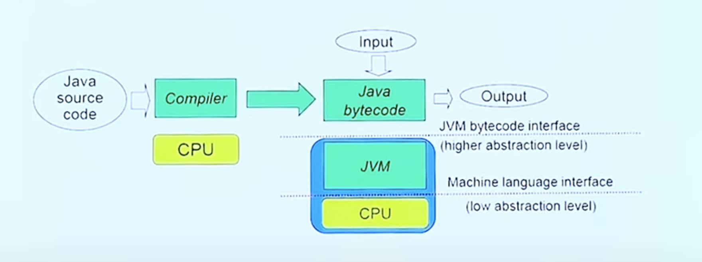

 
 
 

## WORA

> **_“Write Once, Run Anywhere (WORA)” - Sun Microsystems (자바 만든 회사)_**

> 해석 ) 니가 짠 자바 코드를 컴파일해서 배포하면, 어떤 플랫폼이든 다시 컴파일할 필요 없이 실행가능. 근데 실행하려면 그 플랫폼에 맞는 JVM 이 설치되어야 함.

- C/C++ 도 크로스 컴파일해서 배포하면 가능한데 왜 JVM 을 사용하는가 ?

 
 
 

## 자바가 나오던 시절

- 자바가 나오던 시절은 네트워크가 아주 발전하기 시작하던 시절이었음
- 네트워크로 모든 것을 연결하고 다기종의 디바이스에서 실행하기 위한 프로그램이 필요하다 !
  - C/C++ 는 플랫폼 마다 컴파일 해주어야 함..
  - 핸드폰도 나오기 시작하고 PMP 도 나오기 시작함 → 여러 기종에 맞게 다 컴파일할 수 없음
- **자바는 네트워크에 연결된 모든 디바이스에서 작동하는 것이 목적이었다.**
  - 디바이스마다 OS 나 하드웨어가 다르기 때문에 자연스럽게 플랫폼에 의존하지 않도록 언어를 설계했다.
  - 그 결과가 **_Java Bytecode, JVM_**

 
 
 

## 자바의 목적 은 ?

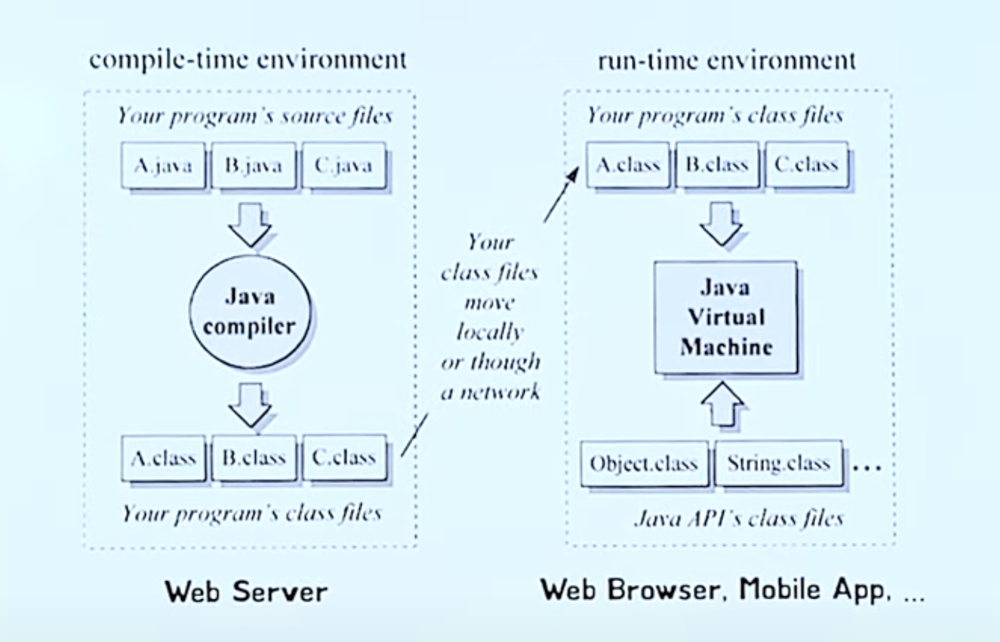

- (왼쪽이 Server, 오른쪽이 Client)

 

- 웹 서버에 `class` 파일이 존재함
  - `class` 파일 : Java Bytecode 를 담은 파일임
- 이 `class` 파일만 네트워크를 통해 전달해주면
- 웹 브라우저에 `JVM` (Java Virtual Machine) 이 설치되어 있어서 이 `class` 파일을 실행하기만 하면 되것네
  - (현재는 자바스크립트가 정확히 이렇게 동작함)
  - 즉, 자바스크립트가 하려던걸 자바가 하려던 거였음

 
 
 

## 자바 코드 실행 까지

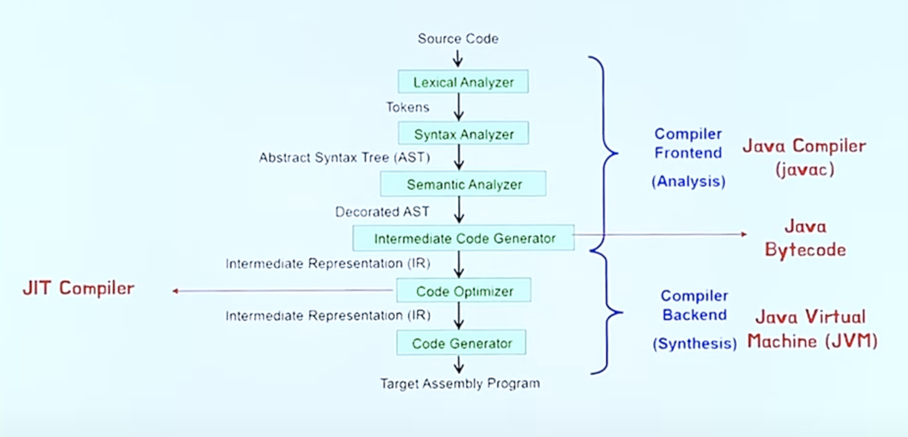

- 자바에 국한된 것이 아닌 모든 컴파일러는 이 과정을 거친다
  - 소스 코드 → (여러과정을 거쳐) Assembly 프로그램 → (어셈블러를 거쳐) 기계어 → 실행
- 컴파일러에도 프론트 엔드, 백엔드가 존재함 !
  - 웹에서는 백엔드는 크게 바뀌지 않고 프론트엔드가 클라이언트 기기에 따라 변화했음
  - 컴파일러는 반대임
  - 컴파일러의 프론트엔드는 우리가 작성한 소스코드를 분석해서 그 의미를 파악하는 일을 함 (= 플랫폼이랑 아무 관련이 없음)
  - 컴파일러의 백엔드는 프론트엔드가 만든 중간계층 언어를 Assembly 언어로 바꿔야함 → Assembly 언어는 OS 나 기기에 의존성이 강함
    - 그래서 백엔드만 윈도우 용이 있고 리눅스 용이 존재하며 프론트엔드는 공유하는 것임
- C/C++ 은 모든 과정을 컴파일러가 통째로 처리함
- 자바는 프론트엔드 과정은 `javac` 가 처리하고 백엔드 과정은 `JVM` 이 하는 것 (하는 일을 분리함)
- C/C++ 은 한번에 모든 컴파일 과정을 하기 때문에 이후에 컴파일할 건덕지가 없음
- 자바는 나눠서 처리하기 때문에 런타임에 어떤일을 하는지 까지 고려하게됨
  - 런타임에 정보를 가지고 최적화를 하는게 JIT 컴파일러 임

 
 
 

## JVM 내부 구조

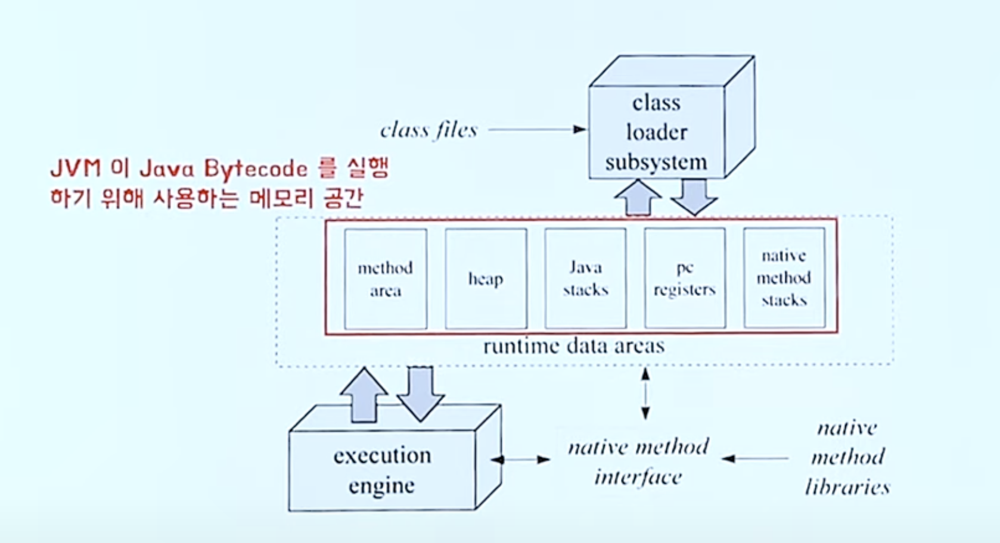

- JVM 이라는 기계안에 여러가지 메모리 종류가 존재함 (= `Runtime Data Areas`)
- 스레드가 공유하는 메모리 공간은
  - **Method Area**
  - **Heap**

 

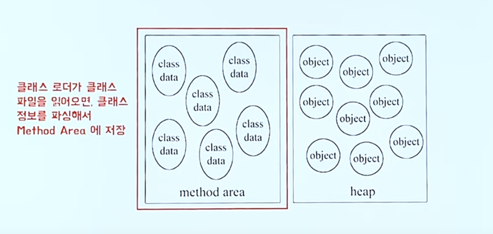

- 변수가 어떤게 있는지 메소드가 어떤게 있는지 정적 변수, Bytecode 는 어떤 것이 있는지

 

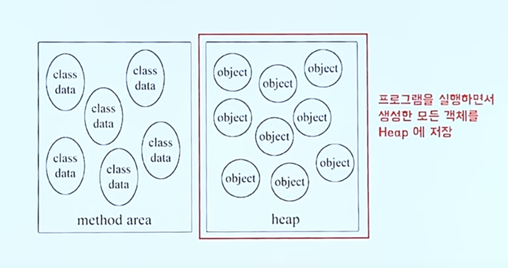

- Heap

 

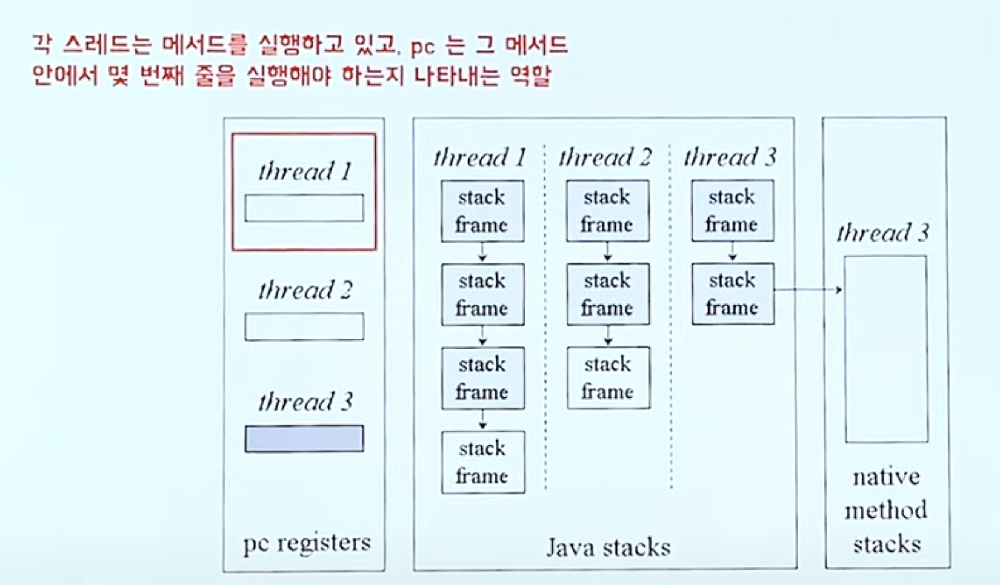

- PC

 

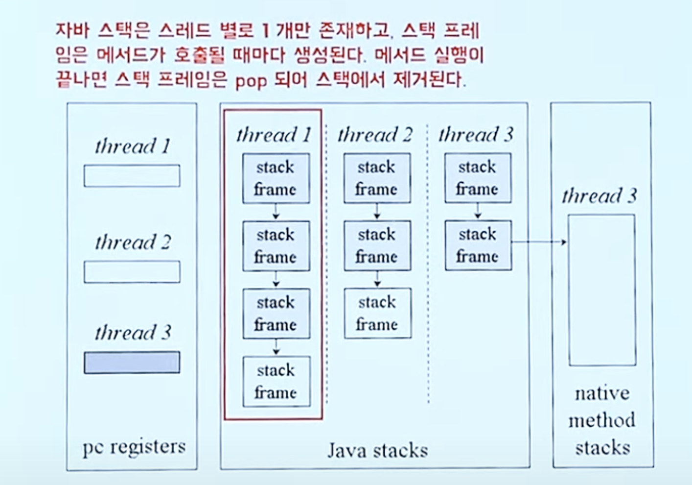

- Stack

 
 
 

Stack Frame

- 스택 프레임은 메서드가 호출될 때마다 새로 생겨 스택에 push 됨
- 스택 프레임은 `Local variables array` , `Operand Stack` , `Frame Data` 를 갖는다
- `Frame Data` 는 `Constant Pool` , 이전 스택 프레임에 대한 정보, 현재 메서드가 속한 클래스/객체 에 대한 참조 등의 정보를 갖는다
  - 실행하기 위해 당연히 필요한 정보들
    (현재 메서드가 어떤 클래스에 속하는지 등)

 
 
 

## 자바 코드 예시

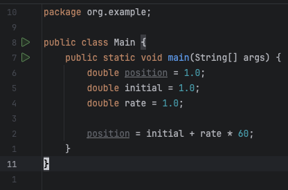

- 결과는 `61.0`

 
 
 

## Local Variable Array

- 로컬 변수가 들어가있는 테이블

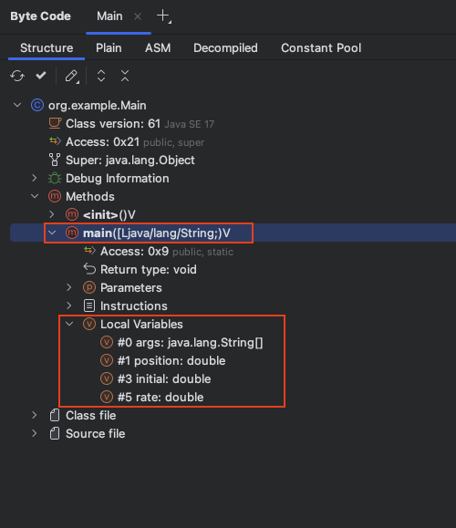

- 인덱스 (Index)
  - `#0`, `#1`, `#3`, `#5`
- 이름 (Name)
  - `args` , `position`, `initial`, `rate`

 
 
 

## PC

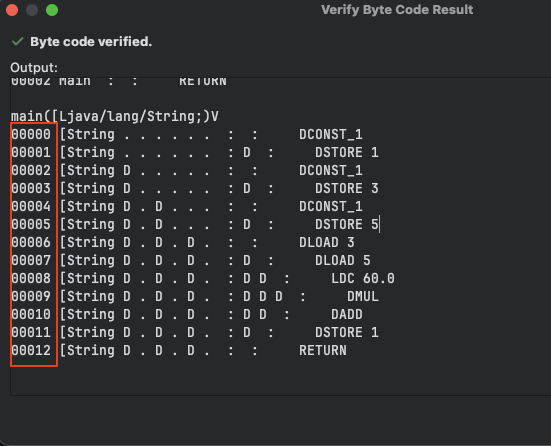

- 현재 실행할 바이트 코드가 몇번째인지

 
 
 

## Operand Stack

- 피연산자 스택

 
 
 

## 설명 (아주 길다)

- 이제부터 바이트 코드 한줄씩 설명

1. Operand Stack 에 1.0 (double constant) 을 push

   - DCONST_1

     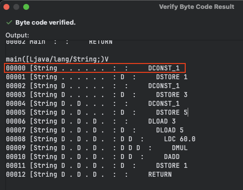

     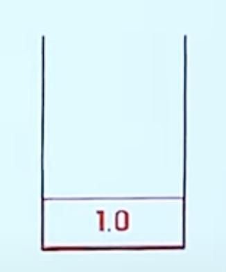

1. Operand Stack 에 pop 한 값 (1.0)을 Local Variable Array 1번 인덱스에 저장

   - DSTORE 1

     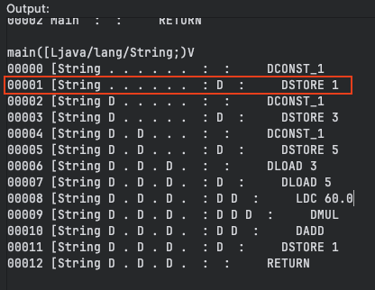

     

     

1. 위 방식과 동일하게 `initial` 변수도 1.0 을 저장

   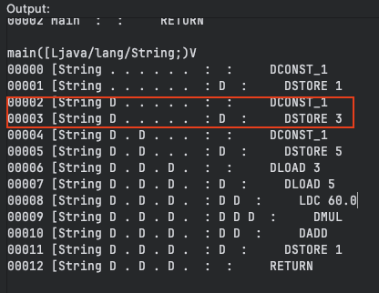

   

1. 똑같이 `rate` 에도 1.0 초기화

   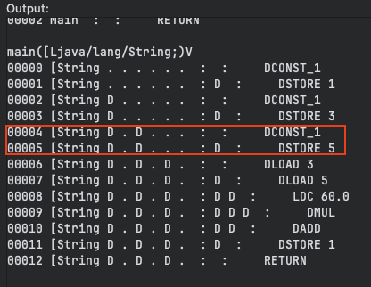

   

1. 이후 Local Variable Array 의 3번 인덱스 값 (`initial`) 을 읽어서 Operand Stack 에 push

   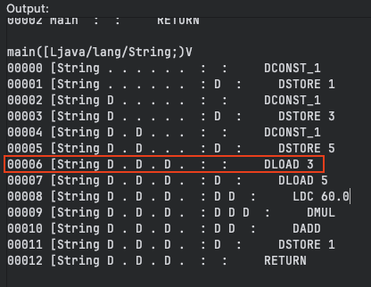

   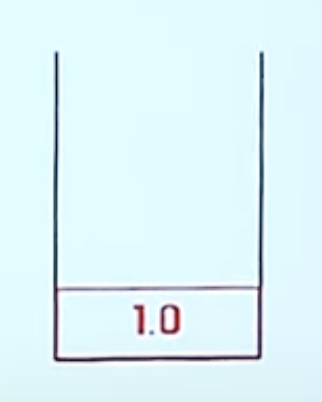

1. 똑같이 Local Variable Array 의 5번 인덱스 값 (`rate) 을 읽어서 Operand Stack 에 push

   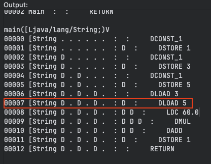

   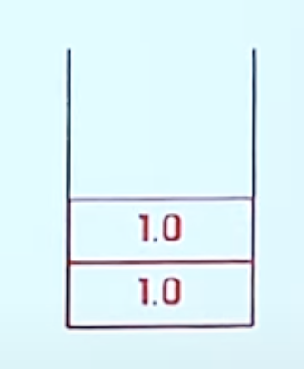

1. constant pool 참조 즉, `LDC` -> Load Constant Pool (double 형식) 을 통해 상수 풀에서 `60.0` 을 가져온다 (double 형 리터럴 `60.0`)

   - 알다시피 상수, 리터럴 값들은 자주 사용할 수 있기 때문에 Constant Pool 에 저장함

     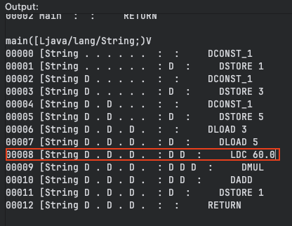

     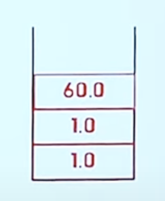

   - 참고) Constant Pool

   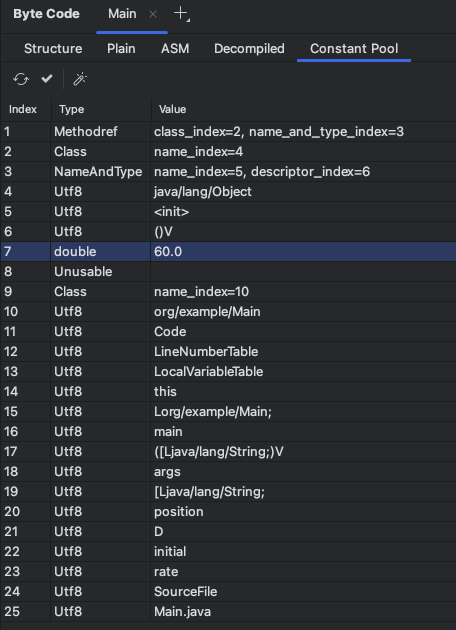

1. Operand Stack 에서 두 값을 pop 하고 곱한 이후 다시 Operand Stack 에 push

   - Double Multiply → DMUL

     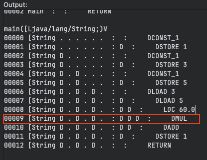

     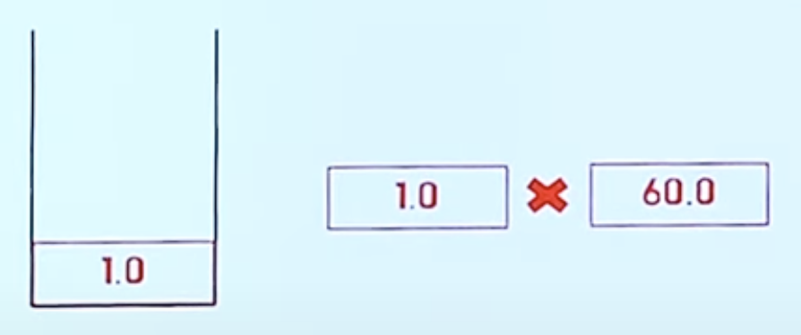

     

   - 보통 어셈블리 같은 경우는 Operator 가 있고 Operand 가 있음 → `mul a b`
   - 그치만 `JVM` 은 Operand Stack 에 Operand 를 다 저장해놓기 때문에 따로 피연산자를 지정하지 않아도 연산이 가능함 → 스택을 이용해서
   - 이런 이유로 `JVM` 은 스택 기반으로 동작한다고 이야기한다.

1. Operand Stack 에서 두 값을 pop 하고 더한 이후 다시 Operand Stack 에 push

   - Double Add → DADD

     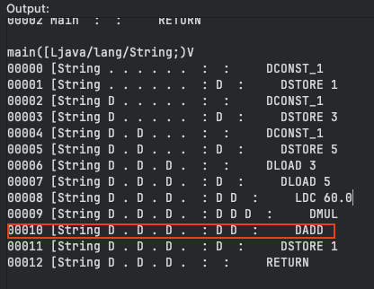

     

     

1. Operand Stack 에서 pop 한 값을 Local Variable Array 1번 인덱스에 저장

   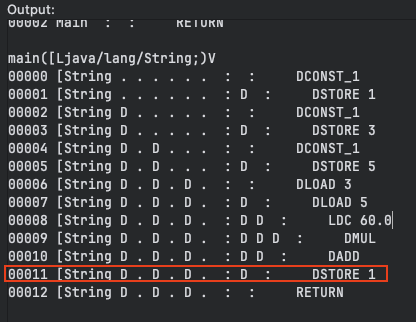

   

   

   - 우리가 작성한 코드를 통해 JVM 은 연산을 시작하며 연산을 할 때는 Operand Stack, Constant Pool, Local Variable Array 등을 사용한다고 볼 수 있다

 
 
 

## 왜 JVM 은 스택을 사용할까 ?

- 우리가 사용하는 머신들은 모두 레지스터를 사용하게 된다
- JVM 도 마찬가지로 가상의 “머신” 인데 왜 레지스터를 사용하지 않고 스택을 사용하는 걸까 ???

### 이유는

- 이전 자바의 목적과 연관되어 있다.
- 자바는 네트워크를 통해 다기종의 디바이스에서 균일하게 동작할 수 있도록 보장하는게 목적이었다
- 그러나, 디바이스 마다 레지스터 수는 다르다 ! → 즉, 몇개의 레지스터가 있을지 가정할 수 없음
  - 레지스터 기반 , 레지스터 1번, 2번 3번으로 구현을 하는 순간
  - 적어도 레지스터는 3개가 있어야 한다
- 스택 기반을 사용하게 되면 계산 과정은 복잡할 수 있어도 실제 하드웨어 스펙에 최소한의 관여만 하게된다
- 즉, 추상화를 하기 위해 스택을 사용했다
  - 바이트 코드가 몇 줄 없어서 레지스터 기반보다 네트워크로 전송할때 이득이 된다 → 이건 잘 몰루?

 
 
 
 
 
 

참조)

- https://www.youtube.com/watch?v=UzaGOXKVhwU
