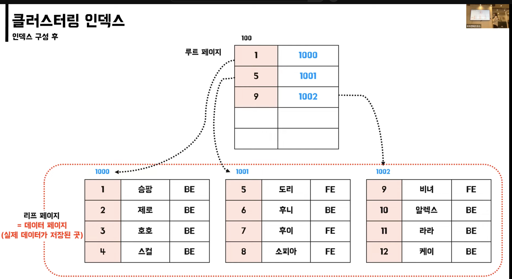
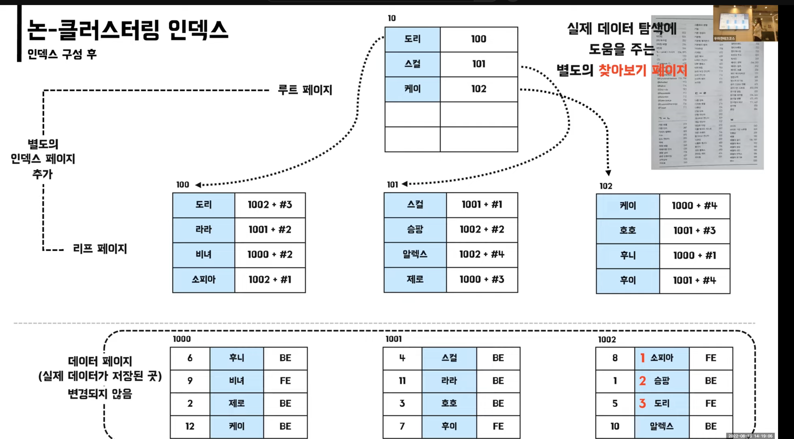

인덱스 즉, 색인을 의미한다

즐겨찾기 페이지에서 목차를 확인하는 등의 원하는 값을 좀더 빠르게 조회하도록

예시


## 데이터베이스에 적용한다면 ?

- 원하는 값을 빠르게 **찾는다**
- SELECT 에 활용할 수 있다

  - 인덱스 컬럼에 대한 조회를 통해야지만 인덱스를 활용함

  ```sql
  SELECT * FROM member (X)

  SELECT * FROM member WHERE merber.id = 1 (O)
  ```

## 인덱스의 특징

- 인덱스는 항상 최신의 정렬상태를 유지
- 인덱스도 하나의 데이터베이스 객체
- 데이터베이스 크기의 약 10% 정도의 저장공간 필요

## 인덱스 알고리즘

### 용어 설명

- 페이지
  - 데이터가 저장되는 단위 (MySQL 16KB)

Full Table Scan

- 순차적으로 접근 (처음부터 찾게 됨)


- 만약 “PPP” 라는 데이터를 찾을 경우
  - 총 3개의 페이지, 12번의 검색을 통해 찾게 됨

### Full Table Scan 이 사용되는 상황은 ?

- 적용 가능한 인덱스가 없는 경우
- 인덱스 처리 범위가 넓은 경우
- 크기가 작은 테이블에 처리할 경우
  - 인덱스를 적용하여도 성능상 이점이 별로 없다고 판단했을 때

B-Tree (Balanced Tree)

- 루트 페이지는 최상단
- 브랜치 페이지는 루트 페이지, 리프 페이지 가운데 여러개가 있을 수 있음
- 리프 페이지는 데이터가 올수도 ROW ID (데이터의 주소) 가 올 수도 있음 (클러스터링 인덱스 OR 논-클러스터링 인덱스)


### PPP 를 찾는 다면 ?

- 총 2개 페이지, 7번 검색


## INSERT, UPDATE, DELETE 의 경우 ?

INSERT

- “OOO” 데이터를 삽입할 때

  1.  

  2.  

  3.  “ZZZ” 라는 값 INSERT

      

  4.  페이지 분할 발생

      

- 데이터를 넣을 때 페이지 변화가 필요하다면 **페이지 분할** 이 일어남
  1. 비어있는 페이지 확보
  2. 문제가 있는 페이지의 데이터를 공평하게 나누어 저장

페이지 분할

- 페이지에 새로운 데이터를 추가할 여유공간이 없어 페이지에 변화가 발생
- DB 가 느려지고 성능에 영향을 준다

DELETE

- 인덱스의 데이터를 실제로 지우지 않고 사용안함으로 표시를 한다

UPDATE (인덱스에는 UPDATE 는 존재하지 않음)

- UPDATE 는 아래 순서로 처리함
  1. DELETE (기존 값 사용안함 표시)
  2. INSERT (변경된 값 삽입)

Command 에 대한 인덱스 처리는 ?

- UPDATE, DELETE
- WHERE 절로 처리할 대상을 찾기 위한 조회 성능은 향상된다
- 그러나
  - 사용하지 않는 인덱스가 적용되었다면 불필요한 처리량 증가
  - 사용안함 표시로 페이지 낭비 및 인덱스 조각화 심해짐

인덱스 적용 결론

- SELECT : 성능이 향상된다
- INSERT, UPDATE, DELETE : 페이지 분할과 사용안함 표시로 인덱스의 조각화가 심해져 성능이 저하된다


## 인덱스의 종류

1. 클러스터링 인덱스

   

2. 논-클러스터링 인덱스 (보조 인덱스, 세컨더리 인덱스 라고도 불림)

종류는 ?


### MySQL 내의 자동으로 클러스터링 인덱스 적용 방법

- PK 적용
- NOT_NULL + UNIQUE 제약조건시

### MySQL 내의 자동으로 논-클러스터링 인덱스 적용 방법

- UNIQUE 제약조건시

예시.

- 데이터


id 컬럼에 클러스터링 인덱스 적용시

```sql
방법 1.
ALTER TABLE member
ADD CONSTRAINT pk_id PRIMARY KEY (id);

방법2.
ALTER TABLE member MODIFY COLUMN id int NOT NULL;
ALTER TABLE member ADD CONSTRAINT uniq_id UNIQUE (id);
```


- 클러스터링 인덱스를 적용한 컬럼을 기준으로 데이터 정렬을 함



- 정렬한 데이터를 기준으로 루트 페이지 생성 (B-Tree 의 맨 처음 페이지)
  - 리프 페이지 == 데이터 페이지
  - 루트 페이지의 `1000` , `1001` .. 은 리프 페이지의 주소 값
    (루트 페이지에는 리프 페이지의 주소를 가지고 있음)
- 어떤 데이터가 추가되거나 삭제되더라도 정렬은 최신상태로 유지하면서 데이터를 처리한다

### ID 가 7인 데이터 찾기 ?


## 클러스터링 인덱스 특징

- 실제 데이터 자체가 정렬되어 있음
- 테이블 당 1개만 존재 가능 (카디널리티가 높은, 중복도가 낮은)
  - Cardinality (Explain 쿼리시)
    - 중복 값이 허용되지 않으면 0
    - 중복 값이 허용되면 1
- 리프 페이지가 데이터 페이지 이다 (리프 페이지 == 데이터 페이지)
- 아래의 제약조건 시 자동 생성된다
  - primary key (우선순위)
  - unique + not null

```sql
SELECT dept_no, MIN(emp_no)

FROM dept_emp

WHERE dep_no BETWEEN 'd002' AND 'd004'

GROUP BY dept_no;
```

## 논 클러스터링 인덱스 적용 방법

```sql
방법 1.
ALTER TABLE member
ADD CONSTRAINT uniq_name UNIQUE (name);

방법2.
CREATE UNIQUE INDEX uniq_idx_name ON member (name);

방법3.
CREATE INDEX idx_name ON member (name);
```

### 적용 시

- 별도의 해당 컬럼에 대한 인덱스 페이지가 생성된다
  - 리프 페이지 ≠ 데이터 페이지
- 실제 데이터가 저장된 데이터 페이지는 변화가 없음 (정렬 X)
- 리프 페이지는 데이터 페이지의 주소를 가지고 있으며 + offset 또한 같이 존재함 (ex. 1002 + #3)



## name = “라라” 인 데이터 찾기 ?


### 논 클러스터링 인덱스 특징

- 실제 데이터 페이지는 그대로
- 별도의 인덱스 페이지 생성 → 추가 공간 필요
- 테이블당 여러 개 존재
- 리프 페이지에 실제 데이터 페이지 주소를 담고 있음
- unique 제약조건 적용시 자동 생성
- 직접 index 생성시 논 클러스터링 인덱스 생성

## 클러스터링 인덱스와 논-클러스터링 인덱스를 함께 적용하면 ?


- id 는 클러스터링 , name 은 논-클러스터링 적용


**name 컬럼의 논-클러스터링 인덱스의 값은 클러스터링 인덱스의 실제 값이 됨 (즉, ID 컬럼 값이 됨)**

- 데이터 페이지의 주소를 가지고 있지 않음
- 즉, 같이 적용할 시 논-클러스터링 인덱스는 리프 페이지에 기존 실제 데이터 페이지 주소가 아닌 !
  - 클러스터링 인덱스가 적용된 컬럼의 실제 값이 들어있음

## 이유는 ?

- 만약 클러스터링 인덱스에서 데이터를 삽입, 삭제시 페이지 분할이 발생한다면 주소 또한 변경되어야 하기때문에 문제가 생김
- ID 값이 직접 변경하지 않는 한 그대로 유지가능하도록 한 구조로 되어 있음


### name = “라라” 조회


## 어떤 컬럼에 인덱스를 적용해야 할까 ?

- 카디널리티가 높은 (중복도가 낮은) 컬럼
  - 카디널리티 : 그룹 내 요소의 개수 (ex. ID , 주민번호 등)
- WHERE, JOIN, OREDER BY 절에 자주 사용되는 컬럼
  - 조건 절이 없다면 인덱스가 사용되지 않음
- INSERT / UPDATE / DELETE 가 자주 발생하지 않는 컬럼
- 규모가 작지 않은 테이블

### 주의 사항

- 잘 활용되지 않는 인덱스는 제거하자
  - WHERE 절에 사용되더라도 자주 사용해야 가치가 있다
  - 불필요한 인덱스로 성능저하가 발생할 수 있다
- 데이터 중복도가 높은 컬럼은 인덱스 효과가 적다
- 자주 사용되더라도 INSERT / UPDATE / DELETE 가 자주 일어나는지 고려해야 한다
  - 일반적인 웹 서비스와 같은 온라인 트랜잭션 환경에서 쓰기와 읽기 비율은 2:8 또는 1:9
  - 조금 느린 쓰기를 감수하고 빠른 읽기를 선택하는 것도 하나의 방법이다

### 인덱스 확인

```sql
EXPLAIN SELECT * FROM member WHERE id = 1
```

- type 컬럼의 값이 range 라면 가져와야하는 데이터만 조회한 경우
  - 데이터가 10개, 그 중 5개만 필요하다면 5건에 대한 데이터만 조회함
- type 컬럼의 값이 index 라면 인덱스 풀 스캔을 함
  - 인덱스 테이블 모두 풀 스캔 때림

참조

https://www.youtube.com/watch?v=edpYzFgHbqs&t=1052s
