# DB 분산에 대한 정의

## 데이터 분산

- 데이터를 한 곳에 보관하면 관리 측면에서 좋지만 문제가 발생한다
- 데이터 베이스의 용량 이슈 발생
- 자연스레 서비스에서 성능 이슈가 발생
- 그외 단일 장애 지점 등의 이슈

때문에 전략적으로 데이터를 분산화해서 관리해야 한다

데이터 베이스 기준으로 분산에 대한 전략을 알아보자

## 데이터베이스 분산 전략

- 데이터베이스 분산 전략은 몇 가지가 있다
  - partitioning (파티셔닝) : database table 을 더 작은 table 들로 나누는 것
  - sharding (샤딩) : database table 더 작은 table 들로 나누는 것
    - 파티셔닝은 모든 데이터를 동일한 컴퓨터에 저장하지만, 샤딩은 테이터를 서로 다른 컴퓨터에 분산한다는 점
  - replication (레플리케이션) : 전체 혹은 하위 집합을 여러 서버에 복사하는 것

## partitioning (파티셔닝)

- vertical partitioning (수직 파티셔닝)
  - `column` 을 기준으로 `table` 을 나누는 방식
- horizontal partitioning (수평 파티셔닝)
  - `row` 를 기준으로 `table` 을 나누는 방식

## vertical partitioning (수직 파티셔닝)

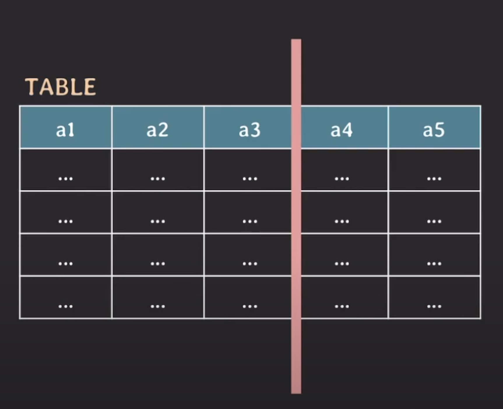

- 위 화면처럼 `column` 을 여러 테이블로 나눈 것

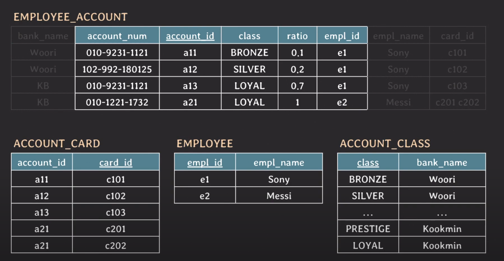

- 즉 **데이터베이스 정규화** 과정이 vertical partitioning 에 해당된다
- 그러치만 vertical partitioning 이 정규화만 있는 것이 아니다, 그 외에도 여러 경우에서 수행될 수 있다
  - 성능을 개선하기 위해
  - 민감한 정보는 접근을 제한하기 위해
  - 쿼리 패턴을 분석해 자주 사용하는 것만 파티셔닝 등
- 그 중 한 예시
  - `artical` 테이블이 존재하고 그 중 `content` 라는 컬럼에는 아주 많은 데이터가 들어가있는데
  - “게시글 목록 보기” 페이지에서는 `content` 는 필요없는 데이터 유형이다
  - 이 경우 vertical partitioning 을 통해 여러가지 이점을 가져올 수 있다

Q. `select` 쿼리를 통해 `content` 컬럼을 제외하면 안되나요 ?

A. 제외하여 최종적으로 조회할 순 있겠지만 일반적으로는 Disk 로 부터 데이터를 가져올때 `row` 기준으로 데이터를 가져온 후 필요한 데이터를 필터링 하도록 되어있으므로 불필요한 `content` 컬럼까지 Disk 에서 데이터를 가져옴

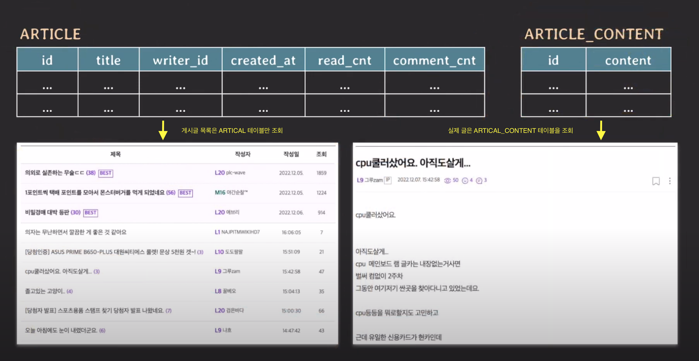

- 만약, 전체 데이터가 필요하다면 `join` 을 통해 가져오도록 구성

 

## horizontal partitioning (수평 파티셔닝)

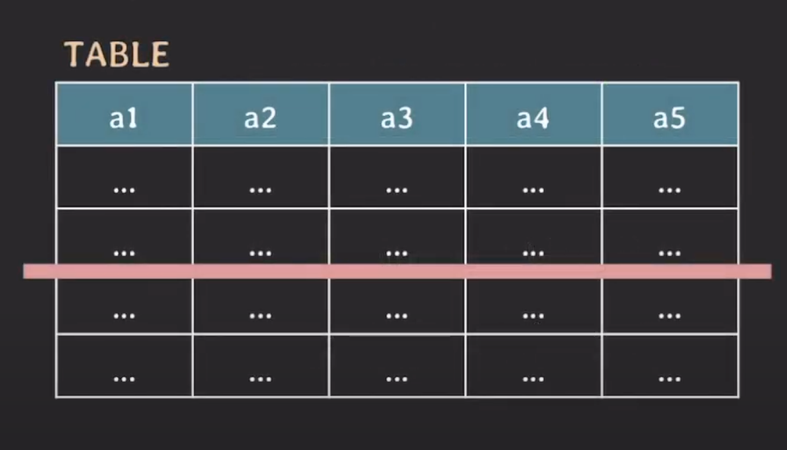

- 위 화면처럼 `row` 을 기준으로 여러 테이블로 나누는 방식
- 테이블의 `schema` 는 그대로 유지된다
- horizontal partitioning 의 적용 예시를 한번 확인해보자
  - 유튜브에서 채널 과 사용자 간의 테이블
  - 사용자가 어느 채널에 구독을 했는지

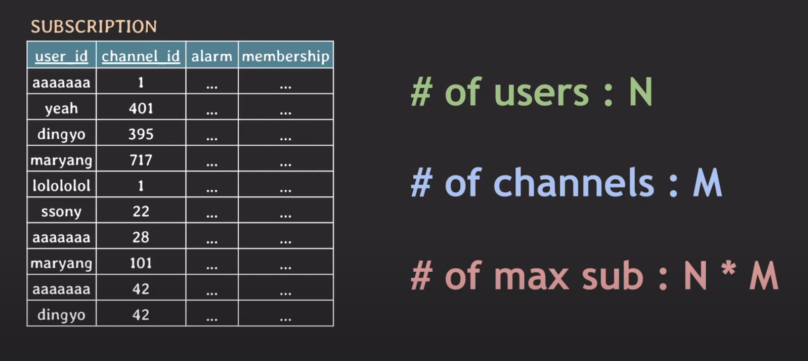

- 위 예시처럼 사용자가 N 명, 유튜브 채널이 M 개 라고 할때 `SUBSCRIPTION` 테이블 (구독) 의 총 개수는
  N \* M 개가 될 것이다 - ex. 모든 사용자가 모든 채널을 구독한 경우
- 주의깊게 살펴봐야할 점은

1. 테이블의 크기가 커질수록 인덱스 테이블의 크기 또한 같이 커진다 (용량)
2. 테이블의 읽기/쓰기 가 발생할 때마다 인덱스에서 처리되는 시간도 조금씩 늘어나게 된다 (성능)

이러한 문제에 대해 horizontal partitioning 을 적용해 문제를 해결할 수 있다

horizontal partitioning 에는 여러가지 전략이 존재한다

대표적으로 `Range Partitioning` , `List Partitioning` , `Hash Partitioning` 을 알아보자

그전에 파티션 키 의 개념에 대해 알아보자

특정 값을 기준으로 파티션된 데이터베이스를 선택할 수 있다고 한다면 해당 값을 파티션 키 라고 한다

(ex. `user_id` 를 통해 분할된 DB 를 검색 혹은 찾아갈 수 있다)

그러므로 “가장 많이 사용될 패턴 (쿼리패턴 등) 에 따라 partition key 를 정하는 것이 중요!” 하다

## Range Partitioning

- 파티션 키의 값 범위에 따라 데이터를 분할합니다
- 예를 들어 날짜 범위로 파티션을 나눌 수 있습니다

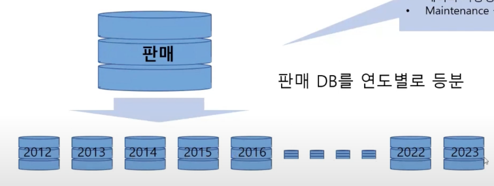

 

## List Partitioning

- 파티션 키의 목록에 따라 데이터를 분할합니다
- 예를 들어 특정 국가 또는 지역으로 파티션을 나눌 수 있습니다

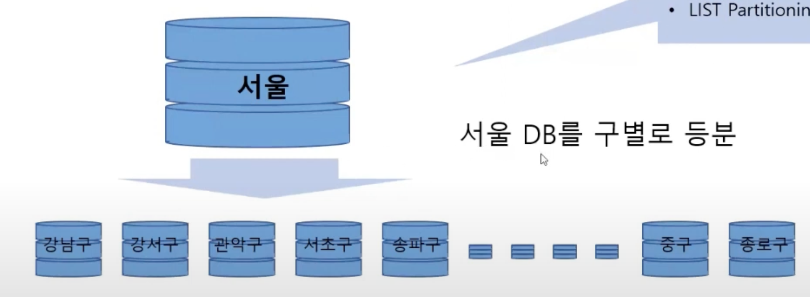

 

## Hash Partitioning

- 파티션 키의 해시 값을 기준으로 데이터를 분할합니다
- 일반적으로 데이터를 균등하게 분할하기 위해 사용합니다

partition 은 한번 분할되어 사용된다면 이후에 partition 을 추가하기 까다롭다

(DB 마이그레이션)

 

## sharding

- horizontal partitioning 과 대단히 유사하다
- 실제 동작자체는 horizontal partitioning 처럼 동작한다
- 차이는 “각 partitiong 이 독립된 DB 서버에 저장” 한다는 차이점이 있다

horizontal partitioning

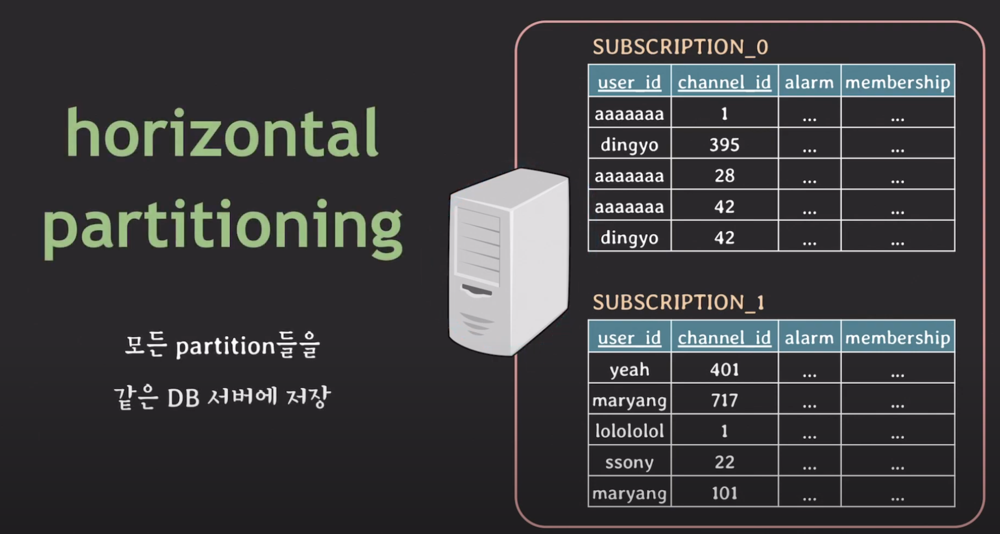

- 하드웨어 자원이 한정적임

sharding

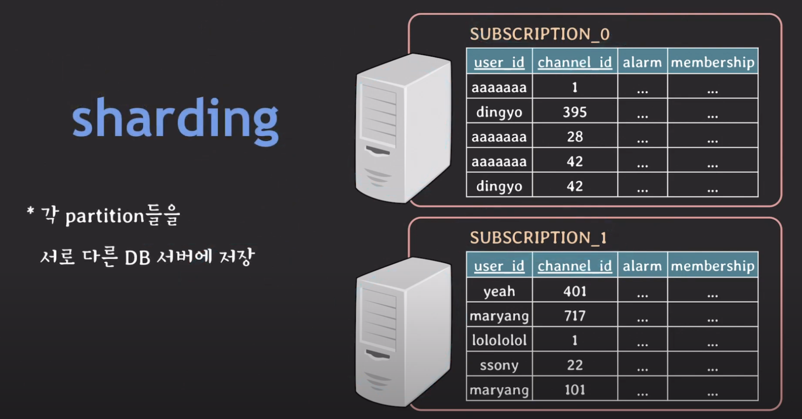

- DB 서버의 부하가 분산됨
- 이때부터는 partition key 를 `shard key` 라고 부름
- 또한 각 partition 을 `shard` 라고 부름
- 샤드 키가 동일한 데이터들은, 동일한 샤드에 위치하게 된다

 

## replication

- 백엔드 서비스에서 게시글 조회를 하려고하는데 해당 DB 서버에 문제가 생긴다면 더 이상 서비스를 지속할 수 없게 된다

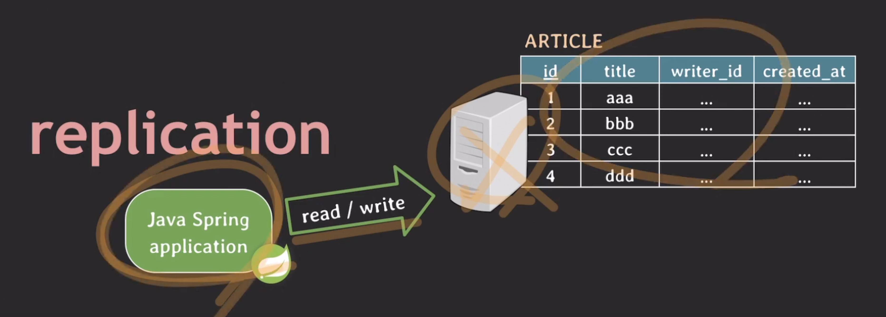

- 그러므로 어떻게든 서비스를 진행해야하는데 그런 문제해결 방식 중 하나가 바로 replication 이다
- 동작 방식은 아래와 같다
- 일단 기존 게시글 DB 서버를 똑같이 복제한 또 다른 DB 서버를 생성한다 (하나 혹은 여러개일 수 있음)
- 각각의 DB는 서로 동기화가 되어야 한다
- 즉, 주요 메인 DB 서버가 존재하고 그에 해당하는 서브, 하위 DB 서버가 존재하는 방식
  - 주 DB 서버를 `master` , `primary` , `leader` 라고 부르기도 함
  - 서브 DB 서버는 `slave` , `secondary` , `replica` 라고 부르기도 함
- 그 이후 주 DB 서버에 문제가 생기면 빠르게 서브 DB 서버를 주 DB 서버로 승격시켜 서비스를 지속가능하도록 유지하는 것
  - 이를 페일오버 라고 부름
- 이런식으로 장애상황이 발생했을 때도 계속해서 서비스를 유지할 수 있는 구성 혹은 이런 특성을 뭐라고 하냐면 “High availability” (고가용성) 이라고 한다
  - 줄여서 “HA”
- 더불어 또 다른 장점은 read, write 의 부하를 분산할 수 있다
- 대부분의 서비스는 read 가 자주 사용하므로 read 쿼리 일부를 서브 DB 서버로 부하 분산을 할 수 있다

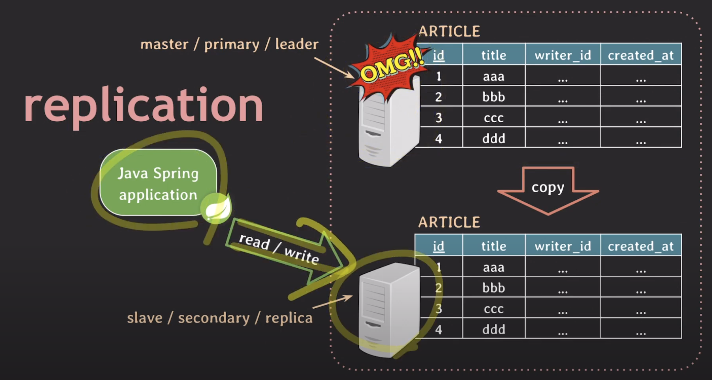
