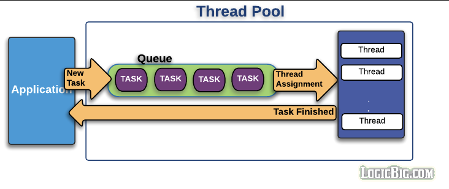

## 스프링 부트 와 톰캣

사실 스프링 부트가 다중 요청을 처리하는 것이 아닌, 스프링부트의 내장된 서블릿 컨테이너 (Tomcat) 에서 다중 요청을 처리해줍니다

(서블릿 컨테이너에 대해서 간략히 이야기하자면 웹 서버의 기능과 더불어 동적 애플리케이션 기능도 하며 서블릿이라고 불리는 자바 기반의 HTTP 요청을 처리하는 클래스를 관리함)

- 스프링 부트는 내장 서블릿 컨테이너인 Tomcat 을 사용
  - 스프링 부트 2.5.4 기준으로 9.0 버전의 Tomcat 을 내장하고 있음
- Tomcat 은 다중 요청을 처리하기 위해, 부팅할 때 스레드의 컬렉션인 Thread Pool 을 생성
- 유저 요청이 들어오면 해당 Thread Pool 에서 서블릿 요청을 처리
  - 1요청, 1스레드
- 작업을 모두 수행하고 나면 Thread 는 Thread Pool 에 반환함

따로 `application.yml` 에 tomcat.threads 설정을 하지 않으면
`springframwork.boot.autoconfigure.web.ServerProperties` 클래스의 기본 설정값을 사용합니다

```java
public Tomcat() {
            this.uriEncoding = StandardCharsets.UTF_8;
            this.maxConnections = 8192;
            this.acceptCount = 100;
            this.processorCache = 200;
            this.maxKeepAliveRequests = 100;
            this.additionalTldSkipPatterns = new ArrayList();
            this.relaxedPathChars = new ArrayList();
            this.relaxedQueryChars = new ArrayList();
            this.rejectIllegalHeader = true;
            this.resource = new Resource();
            this.mbeanregistry = new Mbeanregistry();
            this.remoteip = new Remoteip();
            this.maxHttpResponseHeaderSize = DataSize.ofKilobytes(8L);
        }

        public static class Threads {
            private int max = 200;
            private int minSpare = 10;

            public Threads() {
            }

            public int getMax() {
                return this.max;
            }

            public void setMax(int max) {
                this.max = max;
            }

            public int getMinSpare() {
                return this.minSpare;
            }

            public void setMinSpare(int minSpare) {
                this.minSpare = minSpare;
            }
        }
```

- Threads.max : 생성할 수 있는 thread 의 총 개수
- Threads.minSpare : 항상 활성화 되어있는 thread 의 개수 (idle 상태)
  - 요청이 없더라도 미리 대기중
- maxConnections : 가능한 connection 의 총 개수
- acceptCount : 작업 큐의 사이즈

결국에 톰캣은 Thread Pool 을 통해 스레드 생성에 대한 리소스를 효율적으로 관리하게 되는데 스레드 풀에 대해서 간략히 설명해보자

## 스레드 풀

- Thread Pool 은 프로그램 실행에 필요한 Thread 들을 미리 생성해놓는다는 개념
- 톰캣이 스레드 풀을 활용하기 시작한 이유는 3.2 이전 버전의 스레드 처리에 있습니다
- 3.2 이전 버전에서는 유저의 요청이 들어올 때마다 Thread를 하나씩 생성하며 요청이 끝나면 삭제했습니다 , 그렇다보니 두가지 문제가 생기게 됩니다
  - 모든 요청에 대해 스레드를 생성하고 소멸하는 것은 OS 와 JVM 에 대해 많은 부담을 안겨준다
  - 동시에 일정 이상의 다수 요청이 들어올 경우 리소스 (CPU 와 메모리 자원) 소모에 대한 억제가 어렵다. 즉 순간적으로 서버가 다운되거나 동시다발적인 요청을 처리하지 못해서 생기는 문제가 생길 수 있다
- 아래는 스레드 풀의 구조이다
- 

</br>
</br>

기본 동작 방식

- TASK 가 들어오면 core size 만큼의 스레드를 생성한다
  - `ThreadPoolExecutor` 에서 기본적으로 유지할 스레드 수
  - **스프링 애플리케이션이 시작될 때는 미리 스레드를 생성하지 않음**
  - minSpareCount ≠ coreSize (둘은 비슷하지만 같은 개념은 아님)
- 유저 요청이 들어올 때마다 작업 큐에 담아둔다
- core size 의 스레드 중 유휴상태 (idle) 인 스레드가 있다면 작업 큐에서 작업을 꺼내 스레드에 작업을 할당하여 작업을 처리한다
  - 만약 유휴상태인 스레드가 없다면, 작업은 작업 큐에서 대기
  - 그 상태가 지속되어 작업 큐가 꽉찬다면 스레드를 새로 생성
  - 이 과정을 반복하다가 스레드 최대 사이즈에 도달하고 작업 큐도 꽉차게 되면 추가 요청에 대해서 connection-refused 오류를 반환
- TASK 가 완료되면 스레드는 다시 유휴상태로 돌아간다
  - 작업큐가 비어있고 core size 이상의 스레드가 생성되어있다면 스레드를 삭제한다

### 그래서, 유저 요청이 들어올 때마다 스레드가 하나씩 할당될 것이고, 작업큐가 가득차면 스레드가 늘어날 것이고, 스레드도 가득차면 유저 요청이 거절됨 ! 라고 생각했다

그러나 스레드, 작업큐 모두 가득차도 유저 요청은 거절되지 않고 순차적으로 처리된다.

## Blocking I/O Connector

- 위와 같이 유저 요청이 거절되는 경우는 BIO (Bloking I/O) Connector 일 때 유효한 이야기이다
- 그러나 톰캣 8.0 부터 NIO (NonBlocking I/O) Connector 가 기본으로 채택되고, 9.0 부터는 BIO 는 `deprecate` 되었다
- BIO Connector 는 Socket Connection 을 처리할 때 Java 의 기본적인 I/O 기술을 사용함 (read(), write())
- 즉, connection 이 닫힐 때까지 하나의 thread 는 특정 connection 에 계속 할당되어 있을 것 이다
- 이러한 방식으로 Thread 를 할당하여 사용할 경우 동시에 사용되는 Thread 수가 동시 접속할 수 있는 사용자의 수가 될 것

## 정리.

- 4, 5번째 요청이 처리된 이유는 **NIO** 비동기 처리 덕분이며 요청 처리를 비동기적으로 진행하므로, 스레드 풀이 고갈된 상황에서도 소켓 수준에서 작업을 처리할 수 있다
  - 즉, 스레드가 할당되지 않은 상태에서도 클라이언트와의 연결을 유지하면서 요청을 관리할 수 있다는 의미
- 요청이 들어오면 NIO Connector 는 소켓을 비동기적으로 관리하고 Poller 스레드가 준비된 소켓들을 감시.
- 요청을 처리할 준비가 된 소켓이 감지되면, 그제서야 해당 요청이 스레드 풀에서 Worker Thread 로 처리됨
- 즉, 소켓 연결 자체는 비동기적으로 이루어지며 처리할 때만 스레드가 할당됨
  - 스레드 풀에서 처리할 수 있는 요청 수는 한정적이지만, 소켓 연결은 비동기적으로 유지된다 따라서 스레드 풀과 대기 큐가 가득 차더라도 추가적인 요청을 거부하지 않고 요청이 처리 가능한 시점에 순차적으로 스레드가 할당되며 작업을 진행할 수 있게 된다
  - 스레드가 할당되기 전까지 소켓은 대기상태로 유지되며 클라이언트와의 연결을 끊지 안습니다
- 그러나 **BIO방식** 에서는 요청이 들어오면 바로 스레드가 할당되고, 스레드가 블로킹된 상태로 데이터를 처리해야 한다

## NonBlocking I/O Connector

- Java NIO (New I/O) 를 활용한 방식

### Connector

- 톰캣이 클라이언트로부터 들어오는요청을 수신하는 네트워크 단위, 네트워크 연결 설정 및 관리하는 역할
- 네트워크로 부터 데이터 패킷을 회득하며 HttpServletRequest 객체로 변환 및 Servlet 객체에 전달하는 역할

참고)

- ThreadPoolExecutor
  - 톰캣이 다수의 클라이언트 요청을 처리할 때 효율적으로 스레드를 관리하는 방식
  - 자바 표준의 스레드 풀 구현체이며, 톰캣도 이 `ThreadPoolExecutor` 를 사용해 스레드 풀을 관리함, 여기에 더 특화된 설정을 가지고 사용함
    - `org.apache.tomcat.util.threads.ThreadPoolExecutor`
- minSpareCount ≠ coreSize
  - CoreSize
    - `ThreadPoolExecutor` 에서 기본적으로 유지할 최소 활성 스레드의 수를 의미함
    - 이 수만큼의 스레드는 작업이 없더라도 미리 생성되어 준비되어 있음
      - 작업이 없더라도 종료되지 않고 대기 상태로 남아있음
    - 작업이 들어오면 coreSize 만큼의 스레드가 먼저 사용되고, 스레드가 모두 사용 중이라면 새로운 요청에 대해 대기열이 차기전까지 추가 스레드가 생성되지 않고 coreSize 내에서만 스레드가 작업을 처리하게 됨, 그 이후 추가적인 스레드는 필요할 때만 생성됨
  - minSpare
    - 톰캣의 Connector 설정에서 사용하는 값으로 항상 대기 상태로 유지할 최소 유휴 스레드 수를 의미함
    - 톰캣은 HTTP 요청 처리를 위한 것이며 스레드 풀에서 항상 준비된 상태로 유지할 스레드의 수를 나타냄, 이 값 이하로 스레드 수가 감소하면 톰캣은 스레드를 더 생성해 `minSpareThreads` 값에 맞게 유지함
  - 설정은 ?
    ```java
    @Configuration
    public class Config {
        @Bean(name = "taskExecutor")
        public ThreadPoolTaskExecutor taskExecutor() {
            ThreadPoolTaskExecutor executor = new TheadPoolTaskExecutor();
            executor.setCorePoolSize(10);
        }
    }
    ```
    그 외는 톰캣 자체의 설정 파일을 더 구체적으로 커스터마이징하는 듯

Tomcat에서 `coreSize = 5`와 `minSpareThreads = 20`으로 설정하면 두 설정 간의 차이는 다음과 같은 방식으로 작동합니다:

### 1. **`coreSize = 5`**

- `coreSize`는 **기본적으로 유지되는 스레드 수**입니다. 즉, 최소 5개의 스레드는 항상 존재하며, 요청을 처리할 준비가 되어 있습니다. 이 값이 설정되면, 초기 스레드 풀에서 최소 5개의 스레드가 시작되고, 추가 요청이 오기 전까지 이 스레드들이 유휴 상태로 남습니다.

### 2. **`minSpareThreads = 20`**

- `minSpareThreads`는 **유휴 상태로 유지되는 최소 스레드 수**를 나타냅니다. `minSpareThreads = 20`으로 설정하면 Tomcat은 요청이 없더라도 항상 20개의 스레드를 유휴 상태로 유지하려고 합니다.
- 만약 20개 이하로 유휴 스레드 수가 떨어지면, Tomcat은 이를 보충하기 위해 새로운 스레드를 생성합니다.

### 차이점

- **스레드 풀 초기화**: `coreSize = 5`이면 서버가 시작할 때 5개의 스레드가 생성됩니다. 하지만 `minSpareThreads = 20`이기 때문에, Tomcat은 20개의 스레드가 유휴 상태로 유지되도록 더 많은 스레드를 생성합니다. 따라서 서버 시작 시점에 결과적으로 20개의 스레드가 준비되게 됩니다.
- **동작 방식**: `minSpareThreads`가 `coreSize`보다 큰 경우, 실제로는 `minSpareThreads` 값이 우선시됩니다. 요청이 없더라도 유휴 상태의 스레드가 20개가 되도록 유지되며, `coreSize`는 기본 스레드 풀의 최소 크기일 뿐입니다. 따라서 `coreSize`보다 `minSpareThreads`가 더 클 경우, 초기 생성된 스레드가 유휴 상태가 아니더라도 Tomcat은 추가 스레드를 만들어 최소 유휴 스레드 수를 맞추려고 합니다.

### 요약

`coreSize = 5`로 설정되었을 때는 최소 5개의 스레드가 항상 존재하지만, `minSpareThreads = 20`이면 Tomcat은 서버가 실행되는 동안 최소 20개의 스레드를 유휴 상태로 유지하려고 하기 때문에, 더 많은 스레드가 활성화됩니다. 이러한 설정은 트래픽이 갑자기 증가할 때 빠르게 처리할 수 있는 준비된 스레드 풀을 유지하는 데 도움이 됩니다

</br>
</br>
</br>

Java NIO

- 기본 Blocking I/O 는 InputStream, OutputStream 으로 동작하며 Stream 이 끝날때까지 아무것도 못함
- 기본 개념
  - Channel (채널)
    - NIO 에서 데이터를 읽고 쓰는 기본적인 인터페이스 (ex. `SocketChannel`, `FileChannel`)
    - 블로킹이 아닌 방식으로 동작할 수 있으며 읽기나 쓰기 작업이 완료될 때까지 기다리지 않고 비동기적으로 데이터를 처리할 수 있음
  - Buffer (버퍼)
    - 채널과 함께 데이터를 처리하는 공간, 데이터를 읽거나 쓸 때 버퍼를 사용하여 데이터를 임시로 저장함
    - 버퍼는 데이터를 기록할 수 있는 위치와 읽을 수 있는 위치를 추적하여 효율적인 데이터 처리가 가능하게 해줌
  - Selector (셀렉터)
    - 여러 채널을 하나의 스레드에서 감시 (관리) 할 수 있게 해줌, 여러 연결을 동시에 처리하는 경우 모든 연결을 감시하고 데이터가 준비되었을 때만 실제 작업을 할당하는 방식
    - 셀렉터는 여러 채널을 등록하고 어떤 채널이 준비되었는지 감시한 후에 준비된 채널에만 작업을 할당하여 효율적인 I/O 처리를 가능하게 한다
