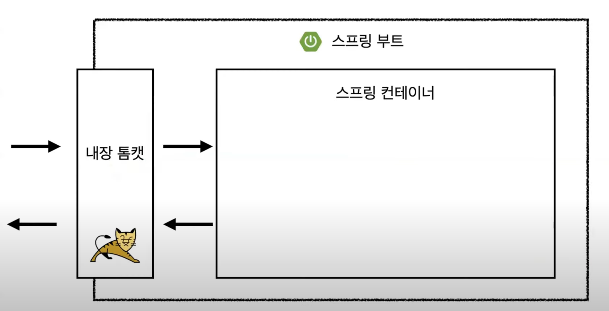
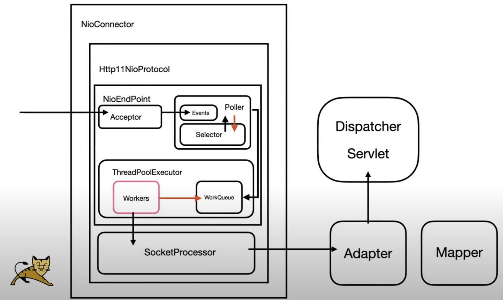
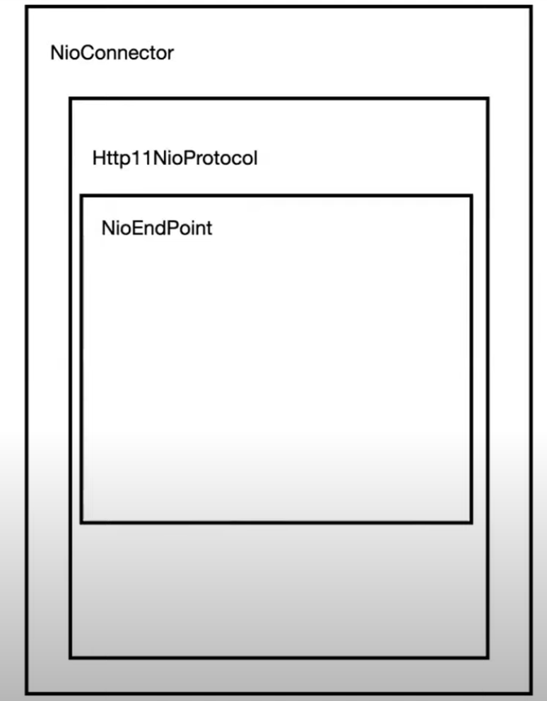
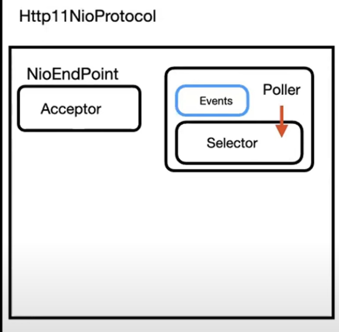
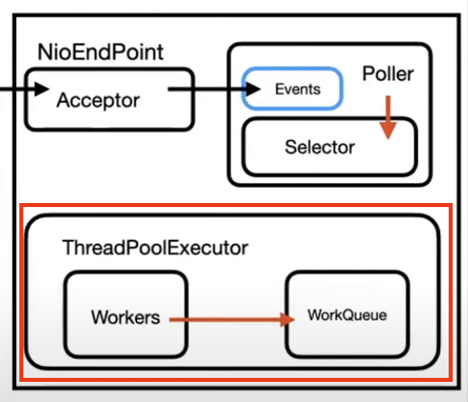
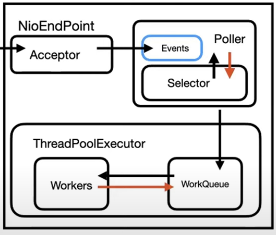
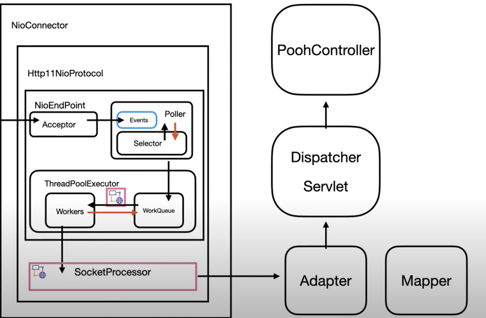
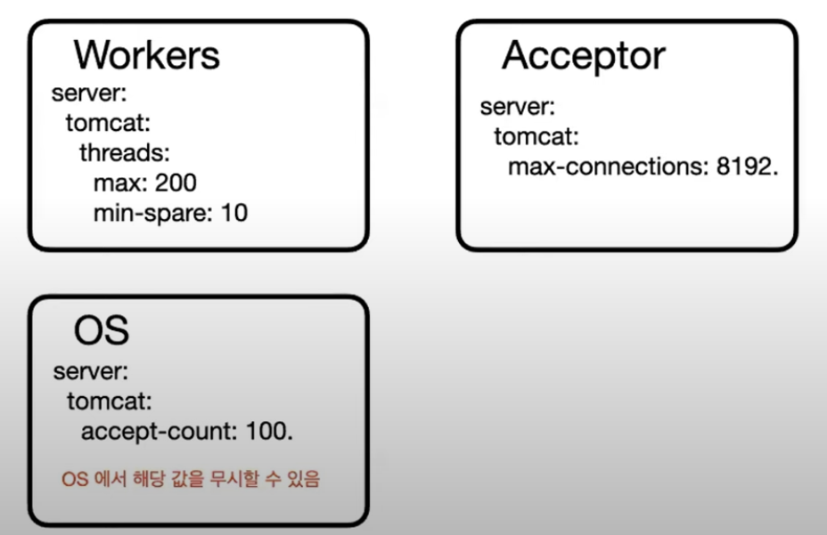
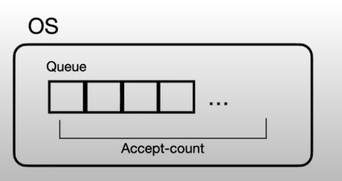

목표

- Tomcat 의 스레드 풀을 통한 사용자에서 Controller 까지

```java
@RestController
public class HelloController {
    @GetMapping("/hello")
    public String hello() {
        return "hello"
    }
}
```

이 때 요청이 어떻게 Controller 까지 도착할 수 있었을까 ?

스프링 부트 구조 도식화

- 
- 요청은 어디서 스레드를 할당하고
- 스레드를 얻기 위한 스레드 풀은 어디서 관리할까?

→ 간단히 이야기하자면 _내장 톰캣_ 에서 관리되어진다

아래 내용은 **NIO Connector** 를 기반으로 설명을 한다 (스프링 부트 3.1.4 이상, 톰캣 8 버전 이상)

</br>
</br>

# NIO Connector 구조

- 

</br>

너무 복잡하다.. 천천히 하나씩 진행해보자

</br>

- 
- `Http11NioProtocol` : 톰캣이 HTTP/1.1 요청을 처리할 때 비동기적으로 처리하는데 사용되는 프로토콜 구현 클래스
  - HTTP/1.1 요청을 처리할 때 NIO 를 활용하여 비동기적으로 처리
- `NioEndPoint` : 톰캣의 NIO Connector 의 중요한 역할을 하는 클래스

  - 네트워크 소켓 통신을 관리하는 핵심 컴포넌트 이며 소켓 바인딩 (포트 바인딩) + 클라이언트 연결 + 요청 대기 + 스레드와의 협업 등을 처리함

  </br>

  ## NioEndPoint

- 
- `Acceptor` : socketChannel 을 기다렸다가 받아들인 후 Poller 의 Events 에 넘겨줌
  - (= socket.accept())
- `Poller` : 준비된 채널을 스레드 풀에 전달한다 (= 작업 준비가 완료된 채널)
  - `Events` : Poller 가 관리하고 있는 채널들의 큐를 의미함
- `Selector` : Events 에서 준비된 채널이 있는지 확인한다

준비된 채널이란

- 작업 준비가 완료된 채널
- 채널 연결 과 준비된 채널 (작업을 위한 준비) 는 다르다
  - 채널 연결 시점 과 작업 준비 완료 시점은 다르다
  - 소켓이 연결이 되고 연결된 소켓으로 데이터가 넘어오기까지의 시간이 걸리기 때문에, 연결이 된 후 데이터가 모두 넘어와야지만 준비 완료되었다는 의미임
- 작업을 위한 준비 즉, 채널 연결 + 데이터 수신까지 모두 완료한 채널을 의미함

이렇게 생성을 하면 Poller 는 Selector 에게 반복적으로 준비된 채널이 있는지 질의함

```java
while(true) {
    selector.selectNow();
}
```

- Poller → Select

이 과정을 소켓 연결을 대입하며 풀어보자

1. 소켓 연결이 되면 `Acceptor` 가 채널을 받아들인다.
2. `Acceptor` 는 `Poller` 의 `Events` 라는 채널 큐에 넘겨주고 이때부터 ! `Selector` 는 `Events` 를 모니터링하기 시작한다

</br>

## 스레드 풀

- 
- Worker Thread 와 처리해야할 작업을 관리한다
  - Worker Thread 는 개념적인 용어를 의미함, 스레드 풀에서 할당된 스레드가 주어진 작업을 처리하는 역할
  - 서버에서 작업을 처리하는 특정 스레드를 지칭하는 개념으로 톰캣에서는 요청을 실제로 처리하는 스레드를 의미함
  - 톰캣은 클라이언트로부터 요청이 들어오면 해당 요청을 처리할 수 있는 Worker Thread 를 스레드 풀에서 가져와 할당함

그러면 `Poller` 를 통해서 스레드 풀에 작업 (TASK) 이라는 것을 넘겨보자

1. `Poller` 가 `Selector` 에게 준비된 채널이 있는지 질문한다
2. `Selector` 가 준비된 채널을 감지하고 `Poller` 에게 준비된 채널이 존재한다고 반환한다
3. 그 시점에 `Poller` 는 준비된 채널을 달라고 `Selector` 에게 요구한다
4. `Poller` 는 스레드 풀에게 해당 채널을 넘겨준다

- 
- 위 순서를 도식화 한 구조

## ThreadPoolExecutor

- 스레드 풀에는 방금전 작업을 받아 쌓아놓는 `WorkQueue` 가 있고 실질적으로 작업을 처리하는 `Workers` 가 존재한다
- `Workers` 는 `workQueue` 에 자신이 해야할 작업이 있는지 계속해서 물어본다

```java
while(workQueue.getTask()) {
}
```

- `workQueue` 에 작업이 내려온다면 작업을 할당받는다
- `Workers` 는 할당받은 작업을 처리하기 위해 `Servlet` 으로 간다

workQueue 는 Selector + Poller 에 의해 **_바로 처리할 수 있는 준비완료_** 된 작업들이 등록된다

- 즉, `Workers` 는 연결된 시점, 데이터가 넘어오는 시점 들을 안기다리고 바로 작업을 할 수 있다
- idle 시간 없이 바로 작업을 할 수 있다

## Workers 는 어떻게 Servlet 에 도달할까 ?

- `Acceptor` 가 소켓이 연결되는 시점에 받은 채널은 `SocketChannel` 객체
- 해당 `Acceptor` 가 `Poller` 의 `Events` 에 채널을 넘기는 시점에 채널을 wrapping 해서 `PollerEvent` 라는 객체로 넘긴다
- 이후 `Poller` 가 스레드 풀에 작업을 넘겨줄때 `SocketProcessor` 라는 객체로 wrapping 해서 `WorkQueue` 에 넘겨준다

</br>

### SocketProcessor

- Adaptor 와 Mapper 라는 객체를 알고있는데 두 객체를 통해서 알맞은 Servlet 을 찾아간다
- 
- `Workers` 는 할당받은 작업을 단순히 실행만하면 (= task.run() ) 스레드에 할당되서 클라이언트의 요청을 처리하게 된다

정리)

클라이언트 요청 → Worker Thread (Workers) 에 작업 할당 → 할당된 스레드를 통해 Controller 까지 도달

</br>

## SpringBoot 의 Tomcat 설정

```yaml
server:
  tomcat:
    max-connections: 8192
    accept-count: 100
    threads:
      max: 200
      min-spare: 10
```

- `max-connections` : `Acceptor` 가 수용할 수 있는 최대 연결 수
- `accept-count`: 최대 연결 수용 후 저장되는 OS Queue Size
- `threads.max` : 늘릴 수 있는 최대 Worker 수
- `threads.min-spare` : 최소한으로 유지하는 Worker 수
- 
- `accept-count` 는 OS 에 따라 설정한 값이 무시될 수 있음
  - 1를 설정해도 실제 큐 사이즈가 1이 아니라는 뜻

</br>

### Max-connection 이후의 요청은 톰캣이 받지 않는다

- max-connections 가 8192 일때
- 8193 번째 Socket 은 accept 자체를 하지 않고 8191이 될때까지 무한 대기를 한다
- 8192 번째 소켓이 연결된 시점부터 socket.accept() 를 실행하지 않음
- 그 다음 추가 요청은 톰캣에 연결되지 않고 OS Queue 에 accept-count 만큼 관리됨
- 

</br>
</br>

### keepAlive

- 연결을 요청이 완료된 이후 끊지 않고 계속 유지하는 기술
- 처음 연결을 보낸 후 추가 요청을 보낼 경우 불필요한 핸드 세이크 과정을 생략
- 처음 `Acceptor` 에 연결하면 `Poller` 에 채널을 등록한다
- 그 다음 요청부터는 `Acceptor` → `PollerEvent` 과정 없이 `Selctor` 가 이전에 사용하던 채널로 데이터가 넘어오면 준비된 채널이라고 감지해서 스레드 풀에 처리한다
